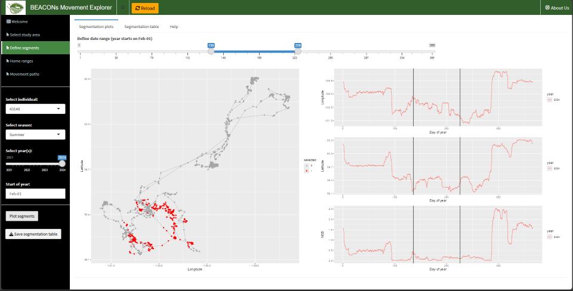

## BEACONs Movement Explorer

June 12, 2025

The BEACONs Movement Explorer is a simple app intended to be used as part of a workflow for exploring movement data. Specifically, the app can help users to:

  - Define seasonal and migration periods in their movement data
  - Estimate seasonal and annual home ranges using a variety of approaches
  - Identify seasonal movement corridors (paths) using a variety of approaches

 

### Running the app

The app can be run from here:

- <https://beaconsproject.shinyapps.io/movement_explorer/>

Alternatively, if you are familiar with R, the app can also be run on a local computer by downloading this repository.

### Issues

- Replace LRH demo with public demo
- Add LRH and WLH choices for inputs (pwd protected?)
- Add today's location as big red dots
- Add ability to select multiple (or all) individuals
- Add multi-individual plots (HR area +/-)
- Add second stats tab for PAs, IPCAs
- Summarize by individual and population for multi-select
- Segmentation
  - Movement app – complete documentation and fix issues (date range?)
  - Date range solution: if start > end then do this else do that
  - The year 2025 produces strange results in triplots
- Ideas
  - Develop dual thingy to simulate monitoring and targeted seasonal surveys
